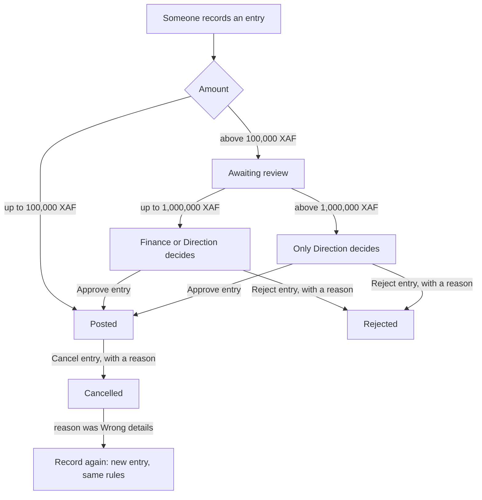
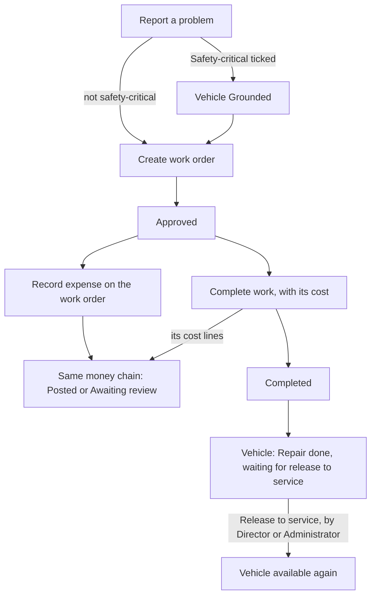

# ROUTIQ team testing guide

For the team testing the October 2026 release on the demo. Read **Start here**, skim the rules, then run the scenarios. About 15 minutes of reading.

## Start here

**Link:** https://routiq.178.156.253.244.nip.io

**Log in.** The login page has three fields:

1. **Workspace** [Espace de travail]: `transports-ngwa` for the trucking company, `littoral-voyages` for the passenger company.
2. **Username** [Nom d'utilisateur]: from the tables in **Who's who**.
3. **PIN code** [Code PIN]: see the team message.

Then press **Sign in** [Se connecter].

**Switch to English.** The app opens in French. Click your name at the bottom of the sidebar, then **My settings** [Mes réglages] → **Language** → **English**. The choice stays on this browser only. This guide uses the English labels, with the French in brackets the first time.

**Pick a branch.** The branch switcher sits at the top right. **All my branches** [Toutes mes agences] shows everything you are allowed to see. Pick one branch to narrow the lists. People who belong to one branch see that branch name and cannot switch.

**On a phone,** the sidebar becomes a bar at the bottom of the screen.

**Report a bug** to the team lead. Send:

- a screenshot,
- the username and company you were logged in as,
- the page (copy the address bar),
- what you did, what you expected, and what happened.

**Shared demo.** Everyone tests on the same data. What you record, others see. Use odd amounts (for example 123,456) so you can find your own entries.

## Who's who

Every person below has a PIN in the team message.

### Transports Ngwa (trucking, workspace `transports-ngwa`)

Branches: **DLA** Douala, **YDE** Yaoundé, **BAF** Bafoussam.

| Username | Name | Role | Branches | In the story |
|---|---|---|---|---|
| `emilienne` | Émilienne | Director [Direction] | All | The owner. Approves large amounts, sets approval thresholds, reopens months. |
| `boris` | Boris | Administrator [Administrateur] | All | Runs daily operations. Opened the brake work order on VH003. |
| `amadou` | Amadou Bello | Administrator [Administrateur] | Yaoundé | Runs the Yaoundé branch. No trucks there yet. |
| `sali` | Sali | Driver [Chauffeur] | All | Assigned driver of VH003. Recorded the Garoua trip fuel. |
| `patrice` | Patrice | Driver [Chauffeur] | Yaoundé | Yaoundé driver. Sees only his branch and his own money. |
| `herve` | Hervé Mbarga | Technician [Technicien] | All | Workshop. Booked the 310,000 brake parts on VH003's work order. |
| `nadege` | Nadège Fotso | Finance | All | Approves money up to 1,000,000. Locks accounting months. |
| `clarisse` | Clarisse Ewane | Cashier [Caissier / Caissière] | Douala | Douala counter. Records money in and out. No approvals. |

What is on the demo now:

- **VH003** (Mercedes-Benz Actros 2640, LT 482 AB) is grounded. A driver reported "Brake pressure warning on the Kekem descent" as safety-critical. Work order **059DC371** is **Approved**. Its brake parts (310,000, **DLA-2026-00006**) are **Awaiting review**.
- **VH003** also has an open problem with no work order: "Rear mudguard cracked and loose on its bracket".
- **VH001** is in service. Its A/C work order **1E2D1747** is **Completed**, with an 85,000 cost (**DLA-2026-00007**, **Posted**).
- **TR001** is a trailer, registered but not in service.
- Trips: **DLA-2026-00001** closed and complete, **00002** closed with exceptions, **00003** **On the road**.
- Money waiting for Finance: **DLA-2026-00005** (VH003 repair, 450,000) and **DLA-2026-00006** (brake parts, 310,000). Posted: freight revenue 2,850,000, fuel 1,180,000, driver allowance 120,000, tolls 45,000, fuel 86,000, and the A/C cost.
- Accounting months: September and October are open. None is locked.

### Littoral Voyages (passenger transport, workspace `littoral-voyages`)

Branches: **DLA** Douala, **YDE** Yaoundé.

| Username | Name | Role | Branches | In the story |
|---|---|---|---|---|
| `josiane` | Josiane Ndongo | Director [Direction] | All | The owner. Approves large amounts and sets thresholds. |
| `paul` | Paul Essomba | Administrator [Administrateur] | All | Runs the voyages and the fleet. Opened the minibus work order. |
| `eric` | Éric Tchoua | Driver [Chauffeur] | All | Drives the Douala–Yaoundé line. Reported the minibus fault. |
| `aline` | Aline Mbappe | Finance | All | Approves money up to 1,000,000. Locks months. |
| `bertrand` | Bertrand Nkeng | Technician [Technicien] | All | Workshop. Repairs the minibus. |
| `grace` | Grace Ebode | Cashier [Caissier / Caissière] | Douala | Douala ticket counter. Records takings and small costs. |

What is on the demo now:

- **Yutong ZK6122** (LT 731 CE), 70-seat coach, Douala, in service. Its Douala → Yaoundé voyage is closed and complete.
- **Toyota Coaster** (CE 214 LT), 30 seats, Douala, in service. Its Douala → Yaoundé voyage is **On the road** since 07:00 today. It has an open bodywork problem (door seal) with no work order.
- **Mercedes Sprinter** (CE 908 YD), 22-seat minibus, Yaoundé. **Grounded** by an open safety-critical steering problem. Its work order is **Approved**, expected cost 240,000.
- Money entries:

| Entry | By | Amount | Status |
|---|---|---:|---|
| Tolls | `eric` | 5,000 | **Posted** |
| Fuel | `eric` | 92,400 | **Posted** |
| Fuel (no receipt) | `eric` | 58,800 | **Posted** |
| Ticket revenue | `grace` | 384,000 | **Posted**, approved by Aline |
| Ticket revenue | `grace` | 162,000 | **Awaiting review** (Finance) |
| Repairs on the minibus work order | `bertrand` | 185,000 | **Awaiting review** (Finance) |
| Insurance | `paul` | 1,850,000 | **Awaiting review** (Direction) |

**Running a scenario on Littoral Voyages:** swap the usernames.

| Trucking | Passenger |
|---|---|
| `emilienne` | `josiane` |
| `boris` | `paul` |
| `sali` | `eric` |
| `nadege` | `aline` |
| `herve` | `bertrand` |
| `clarisse` | `grace` |

## What changed in this release

- **One Money page** [Argent] for every expense and revenue, with tiles for the month, missing receipts and entries waiting for you.
- **Side-panel forms.** Most forms open in a panel on the right, so the list stays visible.
- **A sidebar shaped by your role.** You only see the pages where you have work. Counts show what waits for you. On a phone, a bottom bar replaces the sidebar.
- **Approval chain by amount.** Small entries post directly. Mid-size ones wait for Finance. Large ones wait for Direction.
- **Cancel entry** with a reason, and **Record again** when the details were wrong.
- **Work orders with costs.** Costs are booked on the work order and go through the same approval chain. Closing a work order can record its cost in the same step.
- **Vehicle workspace.** Each truck or vehicle page has tabs: **Overview**, **Maintenance**, **Money**, **Trips**, **Documents**, **History**, **Details**, plus **More actions** for everything you can do on it. Tabs follow your role: Driver, Technician and Cashier have no **Money** tab, and Cashier has no **Documents**.
- **Record history in words.** History reads as sentences ("Registration added, Boris, 10/8/26"), not codes.
- **A passenger company.** Littoral Voyages runs coaches and minibuses with its own words.

## How money moves

Every expense and revenue is an **entry**. Its status is one of **Posted** [Comptabilisée], **Awaiting review**, **Rejected** or **Cancelled**.

These are the default thresholds. Direction can change them (see below). Direction's own entries post at any amount.

### Who does what with money

| Role | Records | From where | Sees | Decides |
|---|---|---|---|---|
| Director | Expense and revenue | Money, vehicle, trip, work order | Everything | Any pending entry, except their own |
| Administrator | Expense and revenue | Money, vehicle, trip, work order | Everything in their branches | Nothing |
| Finance | Expense and revenue, but no work-order costs | Money, vehicle | Everything in their branches | Pending entries up to 1,000,000, except their own |
| Cashier | Expense and revenue, but no work-order costs | Money | Entries of their branch, including trip money and work-order costs | Nothing |
| Technician | Work-order costs only | The work order, from the vehicle page | Work-order costs | Nothing |
| Driver | Expenses only (fuel, tolls, allowances) | Vehicle (**Log fuel**, **Record expense**) and trip | Only the entries they recorded | Nothing |

Rules to know:

- **The recording form tells you** who will decide. Under **Amount (FCFA)** it says, for example, "Above FCFA 100,000, this entry waits for Finance."
- **Nobody approves their own entry.** Your own pending entries do not appear in your approval list, and their page has no **Approve entry** or **Reject entry** buttons.
- **Finance's and Administrators' own entries** go through the chain like anyone's. A Finance member's own entry waits for another Finance member or Direction.
- **Direction's own entries** post directly at any amount.
- **Approve or reject.** Approvers open **Money** and click the count "N expenses waiting for your approval" in the sidebar. Each row has **Reject entry** and **Approve entry**. Rejecting needs a **Rejection reason**, which the author then sees.
- **Edit while it waits.** The author can use **Edit entry** on their own entry while it is **Awaiting review**. Nobody else can.
- **Cancel entry** [Annuler l'écriture] is for Director and Finance, on a **Posted** entry. On **Money**, use the row's **⋯** menu → **Cancel entry**, or open the entry, click **Open full screen**, then **Cancel entry**. Pick a reason: **Entered twice**, **Didn't happen**, **Wrong details, to record again**, or **Other** (with text). The entry stays in the books as **Cancelled** and a cancellation line takes its amount out of the totals. With **Wrong details**, a **Record again** button opens a prefilled form. The new entry follows the normal approval rules.
- **Thresholds.** Direction opens **Company settings** [Paramètres de l'entreprise] → **Approvals** → **Change approval thresholds**. Two fields: **Posts directly up to** and **Finance approves up to**. **Save thresholds** applies them at once, also to entries already waiting: lowering **Finance approves up to** moves bigger waiting entries to Direction. Everyone else sees a notice, "The approval rules have changed", with a **Got it** button.
- **Accounting months** [Mois comptables]. Finance and Direction can **Lock period**. Only Direction can reopen a month, with a reason. An entry dated in a locked month posts into the current month instead, keeping its own date. If the current month is locked too, the entry is refused.
- **Receipts.** Add a file when you record (**Supporting document (optional)**) or later with **Attach receipt**. The **Missing receipt** tile on Money lists entries without one, except categories that need no receipt (parking, driver allowance, tolls). A Mobile Money, Orange Money or bank reference also counts as proof.

## How a work order moves

Work order statuses: **Submitted**, **Approved** [Approuvé], **Completion submitted**, **Completed** [Terminé], **Rejected**, **Cancelled**. With the default rules a new work order starts **Approved** and **Complete work** goes straight to **Completed**.

| Role | Report a problem | Create work order | Book costs on it | Complete work | Release to service |
|---|---|---|---|---|---|
| Director | Yes | Yes | Yes | Yes | Yes |
| Administrator | Yes | Yes | Yes | Yes | Yes |
| Technician | Yes | Yes | Yes | Yes | No |
| Driver | Yes | No | No | No | No |
| Finance | No | No | No | No | No |
| Cashier | No | No | No | No | No |

Rules to know:

- **Safety-critical** [Sécurité] grounds the vehicle the moment the problem is reported. The vehicle page turns red and says how long it has been grounded.
- **Costs are ordinary expenses.** Open the work order from the vehicle page (**Maintenance** tab, or the work-order link in the red banner) and use **Record expense**. Up to 100,000 posts directly; above that it waits for Finance or Direction like any expense. A work order takes costs only, never revenue.
- Finance, Cashier and Driver can open a work order but have no **Record expense** on it. Drivers see its amounts as "—".
- **Complete work** [Terminer les travaux] asks for a **Work summary** and the cost. If the work order already has posted costs: **No, that's all**, **Yes, add a cost**, or **Invoice not received yet**. If it has none yet, it asks for an amount and offers **No cost** or **Invoice not received yet**. **Resolve the linked problem** is ticked by default.
- After completion the vehicle stays grounded. Its page shows, in amber, **Repair done — waiting for release to service.**
- **Release to service** [Remettre en service] is for Director and Administrator. On a safety-critical repair, the person who completed the work cannot also release the vehicle.

## Trips (Trucking) and Voyages (Passenger)

- **Who:** Director, Administrator and Driver create trips. They can also close them, but a Driver only closes trips they recorded. Only Director and Administrator reopen a closed trip.
- **How:** on **Trips** [Trajets / Voyages], **Record a sheet** fills the whole trip at once: references, vehicle and meters, crew, legs, cargo or seats, and revenue and expenses. **Record sheet** keeps the trip open. **Record and close** closes it.
- **Statuses:** **On the road** and **Closed**. A trip closed with missing crew, legs, revenue or meter readings shows **Closed with exceptions** (or "Closed, N gaps"). Closing is not blocked.
- **Money on a trip:** each revenue or expense line becomes an entry and follows the approval chain. On an open trip, **Record expense** adds one cost. The trip's **Net** counts posted entries only. Drivers see only their own lines; Cashiers see their branch's lines.

## Company types

Both companies run the same app. The words change; the rules do not.

| | Trucking (Transports Ngwa) | Passenger transport (Littoral Voyages) |
|---|---|---|
| English words | Truck, Trip | Vehicle, Trip |
| French words | Camion, Trajet | Véhicule, Voyage |
| Register button | **Register a truck** | **Register a vehicle** |
| Required on a vehicle | Nothing extra | **Seat count** |
| Optional on a vehicle | Axle count, body type, tonnage | Line type |
| Trip sheet section | **Cargo** (description, weight) | **Seats** (seats sold, seats available); legs carry a passenger count |
| Starter categories | Truck, trailer; freight revenue; haulage job; loading | Bus, van; ticket revenue; scheduled journey, charter; crew allowance |
| Shared categories | Fuel, repairs, insurance, parking, driver allowance, tolls; problems: brakes, steering, tyres, lighting, engine, bodywork | Same |

Money approvals, work orders, release to service, months and receipts work the same way in both.

## Test scenarios

Each scenario lists the trucking user. For Littoral Voyages, swap users with the table in **Who's who**. "Try to break it" is where bugs hide; please spend a minute there.

### 1. A small expense posts directly

- **Goal:** entries up to 100,000 skip review.
- **Log in as:** `clarisse` (Transports Ngwa) / `grace` (Littoral Voyages).
- **Steps:** **Money** → **Record expense**. Tab **Expense**. **Category** Parking, **Amount (FCFA)** 12,345, **Payment method** Cash. **Record the expense**.
- ✅ **Expected:** the entry appears with status **Posted**. **Out in October** goes up by 12,345.
- **Try to break it:** amount 100,000 exactly (should post). Amount 0, a negative amount, letters.

### 2. A mid-size expense waits for Finance

- **Goal:** 100,001 to 1,000,000 waits for Finance.
- **Log in as:** `clarisse`, then `nadege`.
- **Steps:** `clarisse` records a Repairs expense of 234,567. Note its number. `nadege` clicks "N expenses waiting for your approval" in the sidebar, finds the entry, clicks **Approve entry**.
- ✅ **Expected:** after recording, status **Awaiting review**, and the hint said "waits for Finance". After approval, **Posted**, and the sidebar count drops by one.
- **Try to break it:** amount 100,001. Approve the same entry from two browser tabs at once.

### 3. A large expense waits for Direction

- **Goal:** above 1,000,000 only Direction decides.
- **Log in as:** `boris`, then `nadege`, then `emilienne`.
- **Steps:** `boris` records a Repairs expense of 1,234,567 on VH001. `nadege` looks for it in her waiting list and opens it from **Money**. `emilienne` opens her waiting list and clicks **Approve entry**.
- ✅ **Expected:** **Awaiting review**. Nadège does not see it in her waiting list and has no **Approve entry** button on it. Émilienne approves it; it becomes **Posted**.
- **Littoral Voyages shortcut:** Paul's insurance of 1,850,000 already waits for Direction. Check `aline` cannot approve it and `josiane` can.
- **Try to break it:** amount 1,000,000 exactly (Finance should decide). 1,000,001 (Direction only).

### 4. Reject with a reason

- **Goal:** a rejection carries a reason the author can read.
- **Log in as:** `clarisse`, then `nadege`, then `clarisse`.
- **Steps:** `clarisse` records an expense of 345,678. `nadege` clicks **Reject entry**, types a **Rejection reason** ("No receipt, please resubmit"), confirms. `clarisse` opens the entry on **Money**.
- ✅ **Expected:** status **Rejected**. Clarisse sees the reason.
- **Try to break it:** reject with an empty reason, or only spaces (should be refused). Approve an entry that is already rejected.

### 5. Nobody approves their own entry

- **Goal:** the maker cannot be the checker.
- **Log in as:** `nadege`, then `emilienne`.
- **Steps:** `nadege` records an expense of 456,789. She opens her waiting list, then the entry itself.
- ✅ **Expected:** **Awaiting review**. The hint said "waits for another Finance member or Direction". The entry is not in her waiting list and has no **Approve entry** or **Reject entry**. She can still change it with **Edit entry**. `emilienne` can approve it.
- **Also check:** `emilienne` records an expense of 2,345,678. It posts directly.
- **Try to break it:** as `nadege`, use **Edit entry** to lower the amount to 50,000. It should post right away.

### 6. Cancel an entry and record it again

- **Goal:** a posted entry is never edited; it is cancelled and replaced.
- **Log in as:** `nadege`.
- **Steps:** open the entry from scenario 1 → **Open full screen** → **Cancel entry**. Pick **Wrong details, to record again** → **Cancel entry**. Click **Record again**, change the amount to 13,579, save.
- ✅ **Expected:** the original shows **Cancelled** and stays in the list. A cancellation line takes its amount out of the totals (tick **Show every line in the books** to see it). The new entry follows the normal rules (here, **Posted**).
- **Try to break it:** cancel the same entry twice. Cancel the cancellation line ("This entry is itself a cancellation…"). Look for **Cancel entry** as `boris` or `clarisse` (they should not have it).

### 7. A driver records fuel on a trip

- **Goal:** drivers capture costs but see only their own money.
- **Log in as:** `sali` (Transports Ngwa) / `eric` (Littoral Voyages).
- **Steps:** **Trips** → open a trip that is **On the road** (trucking: DLA-2026-00003; passenger: the Coaster's voyage) → **Record expense**. Category Fuel, amount 45,678. Save. Then **Home** → **View all entries**.
- ✅ **Expected:** the expense is **Posted** and linked to the trip. The entries page says "Only the entries you recorded appear here." There is no **Money** in the sidebar and no **Revenue** tab in the form.
- **Try to break it:** record 150,000 (should wait for Finance). Open a work order on VH003: amounts show "—", no **Record expense**. On the vehicle, use **More actions** → **Log fuel**.

### 8. The cashier records revenue in her branch only

- **Goal:** cashiers record money in and out for their own branch.
- **Log in as:** `clarisse` / `grace`.
- **Steps:** **Money** → **Record expense** → tab **Revenue**. Open **Branch**. Record 67,890 of revenue with **Record the revenue**.
- ✅ **Expected:** the branch switcher shows Douala and cannot change. The entry is **Posted**. The list holds Douala entries only. No approval buttons anywhere, no **Accounting months**.
- **Try to break it:** revenue of 150,000 (waits for Finance). Look for entries of other branches through the filters.

### 9. A driver grounds a vehicle

- **Goal:** a safety-critical report grounds the vehicle at once.
- **Log in as:** `sali` / `eric`.
- **Steps:** **Trucks** [Camions] → VH001 (passenger: **Vehicles** [Véhicules] → the Toyota Coaster) → **Report a problem**. Category Brakes, a short description, tick **Safety-critical**. **Report the problem**.
- ✅ **Expected:** a red banner: grounded, with your description. **Maintenance** shows one more new problem for `boris` and `herve`. The **Trucks** list counts it under **Attention**.
- **Try to break it:** report a second safety-critical problem on the same truck. Report a non-critical one on another truck (it should stay available). On a truck that is already grounded, it stays grounded. Log in as `nadege`: no **Report a problem**.

### 10. Work order and its cost

- **Goal:** the workshop books costs on the work order, and those costs go through approvals.
- **Log in as:** `boris`, then `herve`, then `nadege`, `clarisse`, `sali`.
- **Steps:**
  1. `boris`: VH001 → **Overview** → **To do** → the new problem → **Create work order**. **Expected cost** 300,000. **Create the work order**.
  2. `herve`: **Trucks** → VH001 → **Maintenance** tab → open the work order → **Record expense**. Category Repairs, amount 234,567. Save.
  3. `nadege`: approve that entry from her waiting list.
  4. `nadege`, `clarisse`, `sali`: open the same work order from VH001.
  On Littoral Voyages, use the Toyota Coaster's door-seal problem, or the minibus work order that is already **Approved** (the minibus is in Yaoundé, so `grace`, a Douala cashier, cannot open it: that is expected).
- ✅ **Expected:** the work order is **Approved**. Hervé's cost shows under **Costs awaiting review**, then under posted costs once Nadège approves it. Finance, Cashier and Driver see no **Record expense** on the work order.
- **Try to break it:** as `herve`, try to record a cost from **Money** (no Money page) or with no work order. As `boris`, look for a **Revenue** option on the work order.

### 11. Close the work order and release the vehicle

- **Goal:** completion and release are two separate steps by two different people.
- **Log in as:** `herve`, then `boris`.
- **Steps:**
  1. `herve`: open the work order from scenario 10 → **Complete work**. Write a **Work summary**. Choose **Yes, add a cost**, add 45,000 for labour. Keep **Resolve the linked problem** ticked. **Complete work**.
  2. `herve`: look at the top of the VH001 page.
  3. `boris`: VH001 → **Release to service**.
  On Littoral Voyages, run it on the grounded Mercedes Sprinter: `bertrand` completes its work order, `paul` releases it.
- ✅ **Expected:** the work order is **Completed**. The 45,000 line is **Posted** (under 100,000). VH001 shows, in amber, **Repair done — waiting for release to service.** Hervé has no **Release to service**. After Boris releases it, the truck is available again.
- **Try to break it:** as `boris`, complete a safety-critical work order yourself, then try to release it (should be refused; `emilienne` releases). Choose **Invoice not received yet**, then try to add the invoice later (known issue #531).

### 12. Branch-scoped users see only their branch

- **Goal:** branch limits hold everywhere.
- **Log in as:** `amadou`, `patrice`, `clarisse` (Transports Ngwa); `grace` (Littoral Voyages).
- **Steps:** look at the branch switcher, **Trucks**, **Trips** and **Money** (where shown).
- ✅ **Expected:** the switcher shows one branch and cannot change. Amadou and Patrice (Yaoundé) see no trucks, because all trucks are in Douala. Clarisse and Grace see Douala only.
- **Try to break it:** as `boris`, copy the address of VH003. Paste it as `patrice`. Expected: "This vehicle does not exist or is outside your branches." Try the same with an entry or a trip.

### 13. Direction changes the approval thresholds

- **Goal:** Direction sets the bands; everyone is told.
- **Log in as:** `emilienne`, then `clarisse`.
- **Steps:** `emilienne`: **Company settings** → **Change approval thresholds**. **Posts directly up to** 50,000. **Save thresholds**. `clarisse`: open **Money** and **Record expense**.
- ✅ **Expected:** Clarisse sees "The approval rules have changed" with the new amounts and **Got it**. The form hint now says "Above FCFA 50,000". An expense of 60,000 waits for Finance.
- **Afterwards:** `emilienne` puts it back to 100,000, so others' tests still match this guide.
- **Try to break it:** set **Finance approves up to** below **Posts directly up to**. Look for **Company settings** as `boris` or `nadege` (they should not have it).

### 14. Finance locks an accounting month

- **Goal:** a locked month takes no new postings; late entries land in the current month.
- **Log in as:** `nadege`, then `clarisse`, then `emilienne`. Tell the team first: this affects everyone.
- **Steps:**
  1. `nadege`: **Accounting months** → row 2026-09 → **Actions** → **Lock period**.
  2. `clarisse`: record an expense of 23,456 with **Date** 15 September.
  3. `emilienne`: **Accounting months** → 2026-09 → **Actions** → **Reopen period**, with a reason.
- ✅ **Expected:** September shows **Locked**. Clarisse's entry is **Posted** with economic date 9/15 and a posting date in October, with a notice that it was posted late. Only Émilienne can reopen.
- **Try to break it:** as `nadege`, look for **Reopen period** (she should not have it). Lock a month that still has entries **Awaiting review**.

### 15. Passenger company: vehicles and voyages

- **Goal:** passenger words everywhere, and seat count is required.
- **Log in as:** `paul` (Littoral Voyages).
- **Steps:** in French, read the sidebar: **Véhicules**, **Voyages**. Switch to English. **Vehicles** → **Register a vehicle**. Fill the required fields, leave **Seat count** empty, click **Register vehicle**. Then fill it with 30 and submit.
- ✅ **Expected:** without seat count: "This field is required." With it: the vehicle is registered. Lists, forms and history say vehicle and voyage (FR) or vehicle and trip (EN), never truck or haulage.
- **Try to break it:** seat count 0, -5, 12.5, letters. On **Trips** → **Record a sheet**, look for a **Seats** section and a passenger count on legs, not cargo.

## Known rough edges

Report these only if they behave differently from what is written here.

- **#436.** At 1440 px wide, the Money list overflows its card. Scroll sideways to see the last columns.
- **#529.** "TrajetDLA-…" / "TripDLA-…": a missing space in the **Linked to** column and on the entry detail.
- **#531.** A work order closed with **Invoice not received yet** cannot receive its invoice later. The app refuses any cost on a **Completed** work order, even though the form says "the invoice is added when it arrives". When you know the cost, choose **Yes, add a cost**.
- **#532.** A Driver can add revenue on a trip sheet, although drivers are meant to record expenses only. The owner is deciding. For now, driver revenue from a sheet waits for approval at any amount.
- **#534.** The amount hint in the recording form names the first approver only. A 1,500,000 expense still says "waits for Finance" although Direction decides. The late-posting notice says "posted to a previous accounting period" when the entry actually lands in the current month.
- **Cancel entry** is not in the entry's side panel. Use the row's **⋯** menu on **Money**, or the full-screen entry page.
- On the **Maintenance** page, the work-order panel has no **Record expense**. Book costs from the vehicle page.
- Nothing is saved while offline. If the network drops, the form shows an error; record it again when you are back online.
- One file attached to a trip sheet counts as the receipt for every entry that sheet created.
- French trucking category "Job de halage" is awkward wording.
